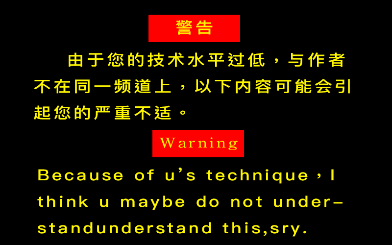

# Keras 的 Web 填坑记

## 0x00 前言

**特别声明**：当你在看这篇文章时，你需要对 keras 的基本用法已经了解和使用，并且具有简单的Python Web开发基础，如果不是，建议你对本篇文章点个赞之后关闭，因为接下来的内容可能会令你感到不适。由于接下来的文章需要我将用简单的代码演示，所以我将使用Keras和Django进行演示(此处的Keras使用的是Tensorflow作为后端)。



之前开发过一个Web网站，需要对上传的图片进行深度学习预测，使用的是Keras作为项目的深度学习后端，前端使用的是Django。本以为分别开发完成Web程式和Keras的学习预测模块之后拼到一起就可以了，鬼知道tensorflow会报错啊？！还报的那么恶心的错误！！！！

部分代码

报的错误截图


```
Tensor Tensor("dense_2/Softmax:0", shape=(?, 10), dtype=float32) is not an element of this graph.
```

这是什么鬼啊！第一次看到这个的错误时一脸懵逼

好吧，深究原因，是因为Tensorflow的运行机制正好和Web有冲突，Tensorflow在后端做预测时是将“图”导入到内存中，之后对图进行计算返回结果，正常情况下这样执行完成之后，程序就Kill掉了，但是由于这里有Web服务，所以那个“图”的计算并没有Kill掉，在第二次执行时，“图”再次被导入计算，由于同时出现了两张一样的“图”，程式就分不清楚哪个是哪个的元素了，于是乎就产生了这样的问题。(PS: 以上一本正经的胡说八道)

既然出现了这样的问题，我就要想办法解决啦，下面，我要开始表演啦！！！前方小高能

## 0x01 第一种解决方案

先来一个小高能，这也是我遇到这个问题之后想到的第一个解决方案，把预测程式打包成一个独立的应用程式，之后每次查询的时候使用系统命令直接调用这个程式，获取返回结果即可。这个想法比较简单，可执行性也是比较高的，但是缺点也很明显，就是每次预测时候都要重新加载一次模型，时间就是金钱啊！

安啦，下面👇才是真高能。高能预警⚠️

## 0x02 比较正统的解决方案

鉴于问题的根本原因，那我们就对症下药好啦，由于是“图”不能同时共存两张，那我们每次都用同一张图就可以了嘛。

```python
import tensorflow as tf
graph = tf.get_default_graph()
```

```python
global graph
with graph.as_default():
    # 执行预测函数
```

嗯，没错，就是这四行代码轻松解决这个问题，超简单啊有木有！！！

部分代码


上传图片操作

页面比较简约，嗯，就是这样。运行结果


连续上传两次，我们可以看见预测时间超级快的说。

## 0x03 结束语

如果本篇文章帮助到了你，实属本人荣幸。如果没看懂，那就算啦。

点赞和打赏是一种美德。

代码详见仓库 https://github.com/ctudoudou/Keras-Web-demo